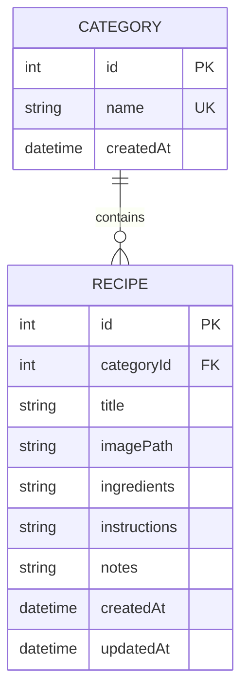
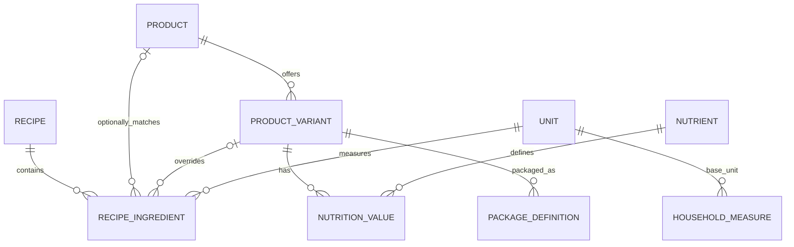

# Model danych

## Model M1

W MVP jeden przepis należy do jednej kategorii, a składniki są tekstem. Jest to świadome uproszczenie czasowe.

## Docelowy model koncepcyjny

Poniższy model wyznacza kierunek, ale nie jest jeszcze zatwierdzonym schematem Drift.

Planowane rekordy:

- `Recipe`,
- `RecipeIngredient`,
- `Product`,
- `ProductVariant`,
- `Unit`,
- `HouseholdMeasure` lub `UnitDefinition`,
- `PackageDefinition`,
- `Nutrient`,
- `NutritionProfile` / `NutritionValue`,
- metadane źródła danych.

W M2 `RecipeIngredient` może nie mieć jeszcze dopasowanego `Product`. Wtedy zachowuje wymaganą nazwę wpisaną przez użytkownika. Relacja z produktem staje się obowiązkowa tylko dla obliczeń, które rzeczywiście jej potrzebują; nie jest warunkiem zapisania przepisu.

## Wymagane własności modelu

- Ilości nie tracą precyzji przy skalowaniu.
- Historyczny przepis nie zmienia znaczenia po cichu po edycji ustawień lub katalogu.
- Usunięcie rekordu referencyjnego nie może uczynić przepisu nieczytelnym.
- Wartości odżywcze mają jawną ilość referencyjną i jednostkę.
- Każdy produkt z danych zewnętrznych przechowuje źródło i identyfikator pochodzenia.
- Brak wartości pozostaje `unknown`, nie `0`.

## Migracja składników tekstowych

Przejście M1 → M2 musi być bezstratne:

1. zachowujemy oryginalny tekst,
2. tworzymy rekordy tylko dla pozycji poprawnie rozpoznanych lub ręcznie zatwierdzonych,
3. nieparsowalne wiersze pozostają widoczne,
4. dopiero po potwierdzonej migracji można rozważyć usunięcie starego pola w późniejszej wersji.

## Otwarte decyzje blokujące schemat docelowy

- `Product` kontra `Food` i rola `ProductVariant`,
- snapshot wariantu w przepisie kontra dynamiczne dziedziczenie ustawień,
- model jednostek wymiarowych i konwersji zależnych od produktu,
- reprezentacja ilości i ułamków,
- wersjonowanie wbudowanego katalogu,
- polityka usuwania i dezaktywacji rekordów użytych historycznie.
