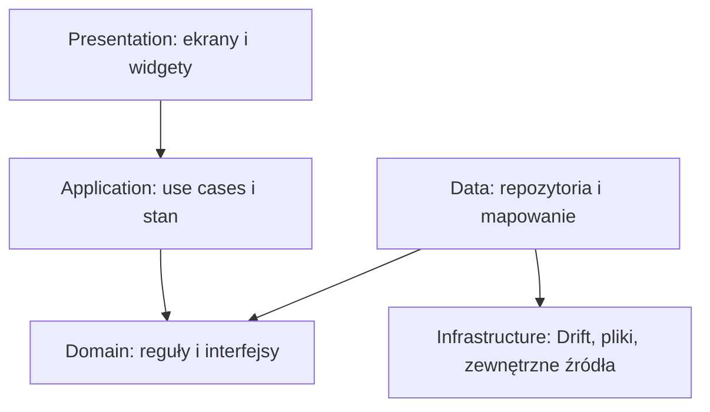
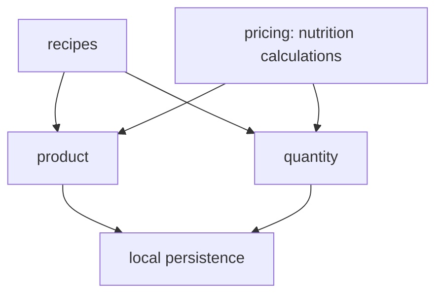

# Przegląd architektury

## Kontekst

Aplikacja działa lokalnie na urządzeniu mobilnym. Nie ma backendu, konta ani synchronizacji. Architektura ma utrzymać prosty UX, a równocześnie przygotować domenę na strukturalne składniki, konwersje i odżywianie. Prywatny preview Flutter Web w ChatGPT Sites daje szybki dostęp do wspólnych przepływów testowych, ale nie jest osobną platformą produktu.

## Warstwy aplikacji



Zależności zewnętrzne są składane przez Riverpod. Widget może wywołać use case lub kontroler, ale nie implementuje konwersji jednostek ani obliczeń żywieniowych.

## Obecny układ MVP

```text
lib/
  core/
  features/
    recipes/
    categories/
  persistence/
  services/
```

Ten układ jest punktem startowym, nie dowodem ukończenia. Przed dalszym rozwojem M0 musi odtworzyć pełny scaffold Flutter, wygenerować prawdziwy kod Drift i potwierdzić build.

## Preview webowy

Zgodnie z [ADR-0006](adr/0006-private-flutter-web-preview-in-chatgpt-sites.md) i [#31](https://github.com/michalbednarczyk1993/Przepisy/issues/31) ten sam projekt udostępnia target Flutter Web publikowany prywatnie przez ChatGPT Sites. Preview służy do częstego sprawdzania layoutu i wspólnych przepływów bez instalowania aplikacji.

Dane preview pozostają lokalne dla przeglądarki. Persistence webowe, zdjęcia i uprawnienia są adapterami infrastruktury i mogą zachowywać się inaczej niż SQLite oraz system plików telefonu. Różnice muszą być widoczne w PR; test webowy nie zastępuje buildów ani UAT Android/iOS.

## Docelowe moduły domenowe



- `recipes` — przepisy i ich składniki,
- `product` — katalog produktów, warianty i pochodzenie danych,
- `quantity` — ilości, jednostki, miary, opakowania i konwersje,
- `pricing` — zaakceptowana w ADR-0004 nazwa modułu kalkulacyjnego wartości odżywczych. Issue [#25](https://github.com/michalbednarczyk1993/Przepisy/issues/25) jest propozycją jej zmiany; dopóki nie powstanie zastępujący ADR, obowiązuje `pricing`.

Moduły mają publikować małe kontrakty. Warstwa presentation nie importuje tabel Drift i nie zna algorytmu konwersji.

## Przechowywanie danych

- SQLite przez Drift jest lokalnym źródłem prawdy dla rekordów.
- Każda zmiana schematu podnosi `schemaVersion` i zawiera migrację.
- Zdjęcia są plikami w katalogu aplikacji; baza przechowuje tylko ścieżkę i metadane potrzebne do zarządzania cyklem życia.
- Wbudowany katalog produktów powstaje z wersjonowanego pipeline'u danych i jest importowany lub dostarczany jako przygotowany zasób.
- Produkty pobrane z sieci oraz użytkownika pozostają lokalne.

## Sieć

Uruchomiona aplikacja nie wymaga sieci do podstawowego działania. Sieć jest potrzebna do opublikowania lub otwarcia prywatnego preview, ale nie dodaje backendu aplikacji. Integracja z Open Food Facts pojawia się w M5 za interfejsem źródła danych. Błąd sieci nie może blokować otwarcia zapisanych przepisów i produktów.

## Nawigacja

`go_router` definiuje trasy. Nawigacja jest częścią warstwy presentation; obiekty domenowe nie zależą od routera ani `BuildContext`.

## Obsługa błędów

- Warstwy niższe zwracają jawne błędy domenowe lub wyniki, zamiast formatować `SnackBar`.
- UI mapuje błąd na komunikat po polsku i zachowuje dane formularza.
- Brak danych do obliczenia jest wynikiem częściowym z ostrzeżeniem, nie wyjątkiem ani zerem.

## Obserwowalność i prywatność

W obecnym zakresie nie ma zdalnej telemetrii. Logi nie mogą zawierać treści przepisów, ścieżek prywatnych ani danych wprowadzonych przez użytkownika w buildach produkcyjnych.
