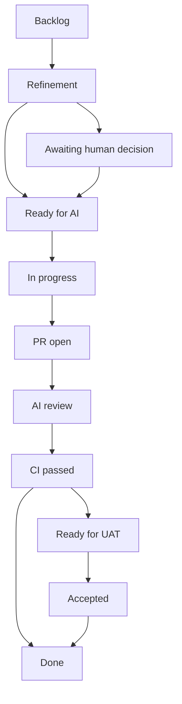

# AI Development Process v1

## Odpowiedzialności

| Rola | Odpowiedzialny | Odpowiedzialność |
| --- | --- | --- |
| Product Owner | Michał | wizja, roadmapa, priorytety i akceptacja produktu |
| Analityk | AI | doprecyzowanie wymagań, edge case'y i kryteria akceptacji |
| Architekt | Michał + AI | decyzje architektoniczne i ADR |
| Tech Lead | AI | plan i rozbicie zaakceptowanego zakresu |
| Developer | AI | implementacja i testy na osobnej gałęzi |
| Reviewer | niezależny AI | review wymagań, diffu, testów i ADR |
| DevOps | AI | CI, bramki jakości i buildy |
| UAT | Michał | test aplikacji z perspektywy użytkownika |

Developer nie zatwierdza sam własnej pracy jako Reviewer.

## Organizacja niezależnego review AI

Za uruchomienie review odpowiada AI prowadzący pracę, nie Michał. Po otwarciu PR i przejściu dostępnych testów przekazuje odrębnemu Reviewerowi AI: Issue, właściwe wymagania i ADR, diff, wyniki testów oraz znane ryzyka. Reviewer pracuje w świeżym kontekście, nie implementuje tej samej zmiany i zapisuje wynik w PR jako `APPROVE`, `BLOCKING` oraz opcjonalne `NON-BLOCKING`.

Jeżeli środowisko nie pozwala uruchomić odrębnego review, PR pozostaje w `AI REVIEW`; brak review nie jest zastępowany samooceną Developera. Michał nie konfiguruje agentów ani promptów — jego rolą pozostaje decyzja produktowa, architektoniczna lub UAT.

## Przepływ zadania

Dokładne statusy GitHub Project:

1. `BACKLOG`
2. `REFINEMENT`
3. `AWAITING HUMAN DECISION`
4. `READY FOR AI`
5. `IN PROGRESS`
6. `PR OPEN`
7. `AI REVIEW`
8. `CI PASSED`
9. `READY FOR UAT`
10. `ACCEPTED`
11. `DONE`

## Od pomysłu do implementacji

Product Owner może opisać potrzebę w rozmowie z AI albo bezpośrednio w GitHub Issue. Przy większej lub niejednoznacznej zmianie używa szablonu Feature lub Decision. Jeżeli potrzeba zaczyna się w rozmowie, AI zakłada Issue, zapisuje wynik, kryteria akceptacji i otwarte pytania oraz linkuje źródłową dyskusję, gdy jest dostępna. Dalsze wiążące ustalenia trafiają do Issue, wymagań lub ADR — nie zostają wyłącznie w czacie.

1. Product Owner opisuje potrzebę w rozmowie albo Issue.
2. AI przygotowuje analizę, UX, edge case'y, wpływ na model i propozycję ADR.
3. Decyzje Product/Architecture/Manual wracają do właściciela jako przypisane Issue.
4. Po akceptacji AI tworzy małe zadania spełniające Definition of Ready.
5. Developer AI realizuje najwyżej priorytetowe `READY FOR AI`.
6. Powstaje PR z testami i dokumentacją.
7. CI wykonuje deterministyczne quality gates.
8. Niezależny Reviewer AI zwraca `APPROVE`, `BLOCKING` i opcjonalne `NON-BLOCKING`.
9. Developer poprawia blokery, a Reviewer sprawdza ponownie.
10. Zmiana trafia do UAT, jeśli wpływa na zachowanie użytkownika.

## Zasady Issues

- Issue opisuje jeden wynik, nie nazwę pliku do zmiany.
- Kryteria akceptacji są obserwowalne i testowalne.
- Zależności są linkowane jawnie.
- Decyzja nie jest ukryta w zadaniu implementacyjnym.
- Epic lub tracker kamienia milowego zawiera checklistę zadań, ale nie zastępuje ich kryteriów.

## Zasady PR

- Jeden PR realizuje jedno Issue.
- PR zawiera `Closes #...`, podsumowanie, testy, ryzyka i kroki UAT.
- Zmiana danych pokazuje migrację i rollback/recovery.
- Zmiana UI zawiera screenshot lub nagranie, gdy środowisko na to pozwala.
- Nie poprawiamy zielonego CI przez wyłączenie zabezpieczenia.

## Project Gardener

Project Gardener jest rolą AI uruchamianą przez AI prowadzącego pracę. Michał nie konfiguruje osobnego agenta.

Przegląd uruchamiamy:

- po domknięciu każdego kamienia milowego, przed rozpoczęciem następnego,
- raz w miesiącu, jeżeli projekt jest aktywnie rozwijany i w danym miesiącu nie było przeglądu kamienia,
- po istotnej zmianie roadmapy, modelu danych, architektury lub procesu,
- na żądanie, gdy pojawia się sprzeczność między kodem, dokumentacją i Issues.

Gardener analizuje kod, dokumenty, Issues, ADR, zależności i testy. Wynikiem jest komentarz w trackerze kamienia oraz osobne Issues dla rozbieżności, TODO, martwego kodu, brakujących migracji i długu. Nie zmienia zakresu produktu i nie naprawia automatycznie wszystkiego w jednym PR.

## Wersja autonomii

Na początku autonomia jest kontrolowana: AI planuje i implementuje, ale zmiany produktu, architektury, danych i procesu wymagają wskazanych akceptacji. Automatyczne mergowanie można rozszerzać dopiero po ustabilizowaniu CI, review i UAT.
