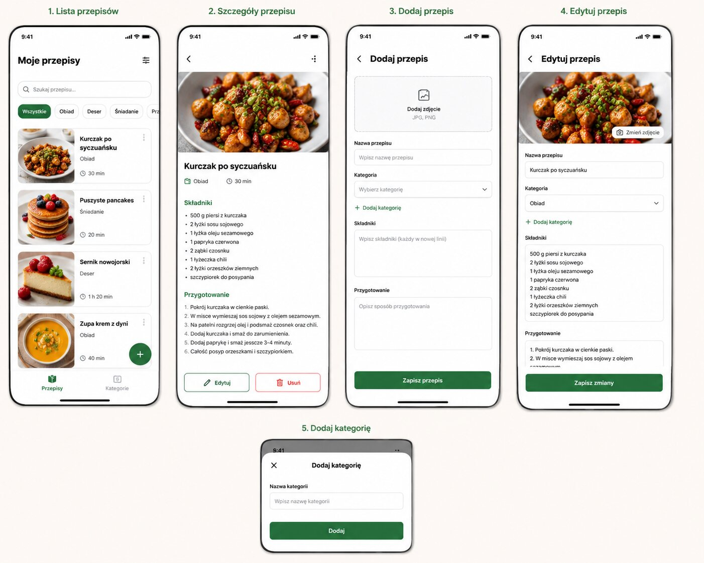

# Materiały UI

## MVP

Mockup jest wizualną inspiracją dla listy, szczegółów, dodawania, edycji i kategorii. Wymagania tekstowe mają pierwszeństwo, gdy materiał jest niejednoznaczny.

## Ustawienia jednostek i wariantów

Drugi uzgodniony mockup pokazujący lokalną zmianę wariantu oraz globalne ustawienia nie był dostępny podczas porządkowania repozytorium. Należy go dodać w osobnym Issue, aby nie opierać przyszłego UX wyłącznie na pamięci rozmowy.
